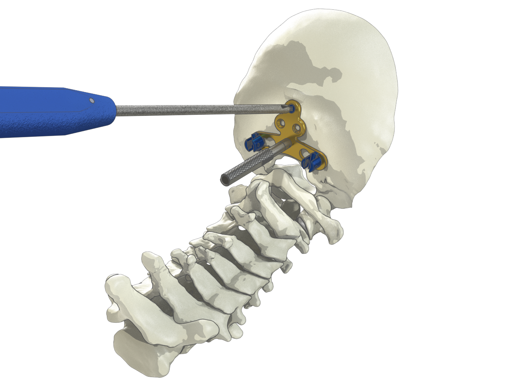

Welcome to my portfolio! Below are selected projects showcasing my experience in the field of Engineering design and development.

---

## Design & Development of Medical Devices

In 2018, I had the opportunity to be the primary engineer responsible for the design and development of a medical device system, covering the full product lifecycle from Design Inputs through Design Transfer. I gathered and translated design inputs from medical consultants and journals into functional designs, created 3D models in SolidWorks, and conducted design reviews with the Principal Engineer. I also drafted the engineering drawings to support manufacturability, ease of assembly, and compliance with ISO 13485 and ASME Y14.5.

A key development to this project was enabling in-house manufacturing of implant and instrument trays. Previously, trays were outsourced, but minimum order quantities made this approach unsustainable. I developed the designs, drawings, and manufacturing processes for internal production of trays and accessories, including caddies, brackets, and silicone holders, resulting in improved flexibility and cost efficiency.

I also contributed to project documentation in collaboration with cross-functional teams. Notably, I authored the Surgical Technique document using SolidWorks renderings instead of third-party software. I standardized materials, rendering settings, and workflows to ensure consistency and reproducibility, reducing setup time and eliminating unnecessary file transfers while maintaining documentation quality.
The project demonstrated my ability to lead engineering work from concept through transfer while maintaining quality, compliance, and efficiency.

